# Intercountry Adoption Statistics Dashboard

## Table of Contents

- [Overview](#overview)
- [Features](#features)
- [Technologies Used](#technologies-used)
- [Usage](#usage)
- [Project Structure](#project-structure)
- [API Endpoints](#api-endpoints)

## Overview

The Intercountry Adoption Statistics Dashboard is a comprehensive web application that visualizes and analyzes data related to international adoptions. This project aims to provide an intuitive interface for exploring adoption trends, comparing statistics across countries and states, and understanding the patterns of both incoming and outgoing adoptions in the United States.

## Features

- **Interactive Maps**: Visualize adoption data on world and US state maps.
- **Time-based Filtering**: Analyze adoption trends across different years.
- **Country and State Selection**: Focus on specific countries or US states for detailed analysis.
- **Multiple Data Views**:
  - Incoming Adoptions by Country of Origin
  - Incoming Adoptions by US State
  - Outgoing Adoptions from the US
  - Adoption Trends Over Time
- **Data Visualization**:
  - Bar Charts
  - Line Charts
  - Pie Charts
- **Responsive Design**: Optimized for various screen sizes and devices.

### Homepage

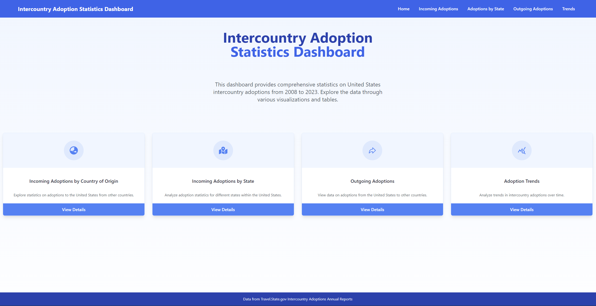
The homepage provides an overview of the dashboard with quick access to different sections:

- Incoming Adoptions by Country of Origin
- Incoming Adoptions by State
- Outgoing Adoptions
- Adoption Trends
  Each section is represented by a card with a descriptive icon and brief explanation, allowing users to easily navigate to their desired data view.

### Incoming Adoptions by Country

#### Data Table

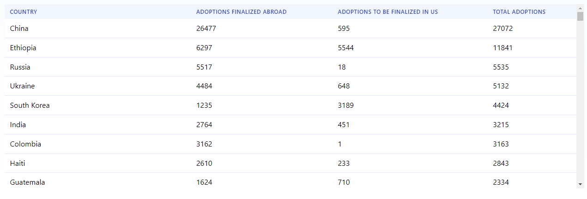
A comprehensive table displaying incoming adoption statistics for each country. Users can:

- View the number of adoptions finalized abroad
- See adoptions to be finalized in the US
- Analyze total adoptions per country
- Sort data by different columns for easy comparison

#### World Map

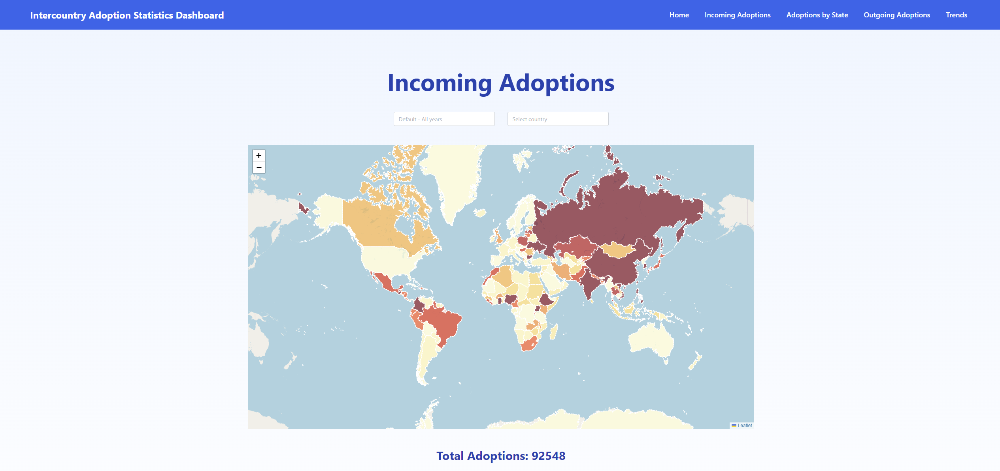
An interactive world map that visualizes incoming adoption data:

- Countries are color-coded based on the number of adoptions
- Hover over a country to see detailed statistics
- Click on a country to focus on its specific data
- Zoom and pan functionality for better exploration

#### Pie Chart

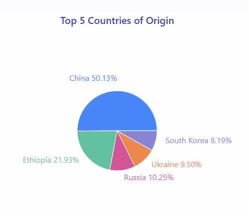
A pie chart showing the distribution of incoming adoptions by country:

- Each slice represents a country's proportion of total adoptions
- Hover over slices to see exact percentages and numbers
- Focuses on top countries for clear visualization of major contributors

### Adoptions by State

#### Data Table

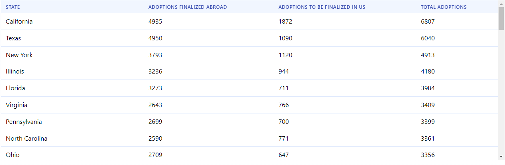
A detailed table showing adoption statistics for each US state:

- Displays adoptions finalized abroad and those to be finalized in the US
- Shows total adoptions per state
- Allows sorting by different columns for easy state-to-state comparison

#### US Map

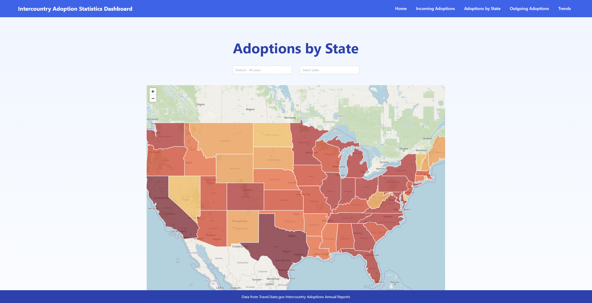
An interactive map of the United States visualizing adoption data by state:

- States are color-coded based on the number of adoptions
- Hover over a state to see its specific adoption statistics
- Click on a state to focus on its data in other visualizations

#### Pie Chart

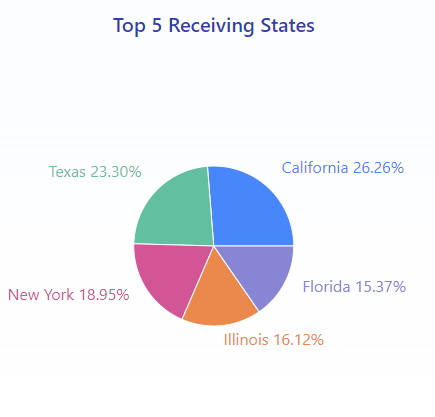

A pie chart illustrating the distribution of adoptions across US states:

- Each slice represents a state's proportion of total US adoptions
- Hover functionality for detailed information
- Focuses on top states to highlight major adoption centers

### Outgoing Adoptions

#### Data Table

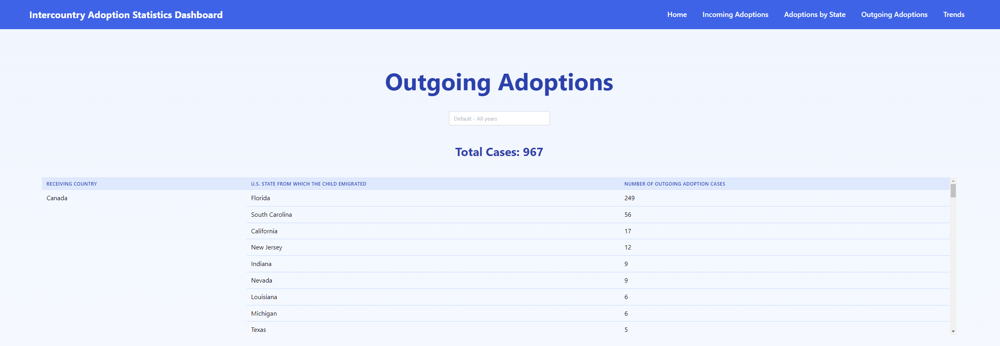
A comprehensive table displaying outgoing adoption statistics:

- Shows receiving countries and the number of cases
- Breaks down cases by US state of origin
- Allows for sorting and easy comparison between countries and states

#### Country Bar Chart

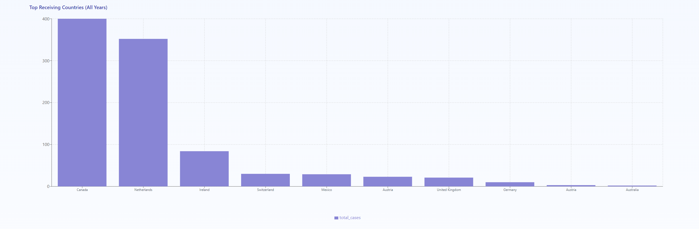
A bar chart visualizing outgoing adoption data by country:

- Each bar represents a receiving country
- Height of bars indicates the number of adoption cases
- Hover over bars for exact numbers
- Provides a quick visual comparison between countries

#### State Bar Chart

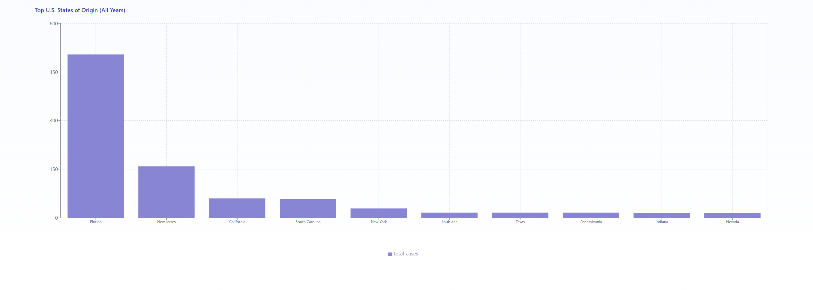
A bar chart visualizing outgoing adoption data by state:

- Each bar represents a state
- Height of bars indicates the number of adoption cases
- Hover over bars for exact numbers
- Provides a quick visual comparison between states

### Trends

#### Trends Page

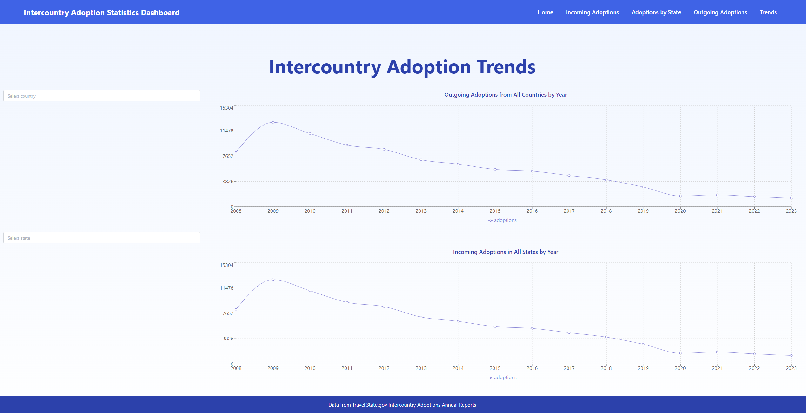
A comprehensive page displaying various adoption trends over the years:

- Line charts showing overall adoption trends
- Ability to compare trends between countries or states
- Options to filter by specific time periods
- Highlights significant changes or patterns in adoption data over time

Each of these features is designed to provide users with multiple ways to interact with and understand the adoption data, from broad overviews to specific details, catering to different analytical needs and preferences.

## Technologies Used

- **Frontend**:
  - React
  - Vite (for build tooling)
  - React Router (for navigation)
  - Recharts (for charts)
  - Leaflet (for maps)
  - TailwindCSS (for styling)
  - Mantine (for UI components)
- **Backend**:
  - Node.js
  - Express.js
  - PostgreSQL
- **Data Source**: Travel.State.gov Intercountry Adoptions Annual Reports

## Usage

After starting the application, you'll be presented with the home page displaying four main sections:

1. **Incoming Adoptions by Country of Origin**: Explore statistics on adoptions to the United States from other countries.
2. **Incoming Adoptions by State**: Analyze adoption statistics for different states within the United States.
3. **Outgoing Adoptions**: View data on adoptions from the United States to other countries.
4. **Adoption Trends**: Analyze trends in intercountry adoptions over time.

Navigate through these sections using the top navigation bar. Each section provides interactive visualizations and filtering options to explore the data in depth.

## Project Structure

The project follows a standard React application structure:

```
src/
├── components/     # Reusable UI components
├── pages/          # Main page components
├── services/       # API service functions
├── hooks/          # Custom React hooks
├── App.jsx         # Main application component
├── main.jsx        # Entry point
└── index.css       # Global styles
```

Key components:

- `CountryMap.jsx` and `StateMap.jsx`: Handle map visualizations
- `DataTable.jsx`: Displays tabular data
- `CustomBarChart.jsx` and `CustomLineChart.jsx`: Create various charts
- `YearFilter.jsx`, `CountrySelection.jsx`, `StateSelection.jsx`: Provide filtering options

## API Endpoints

The application interacts with a backend API. Here are the main endpoints used:

- `GET /api/years`: Fetch available years for data
- `GET /api/states`: Fetch list of US states
- `GET /api/countries`: Fetch list of countries
- `GET /api/incoming-adoptions/:year`: Fetch incoming adoption data for a specific year
- `GET /api/outgoing-adoptions/:year`: Fetch outgoing adoption data for a specific year
- `GET /api/incoming-adoptions-by-state/:year`: Fetch adoption data by state for a specific year

Replace `:year` with 'all' to get data for all years.
